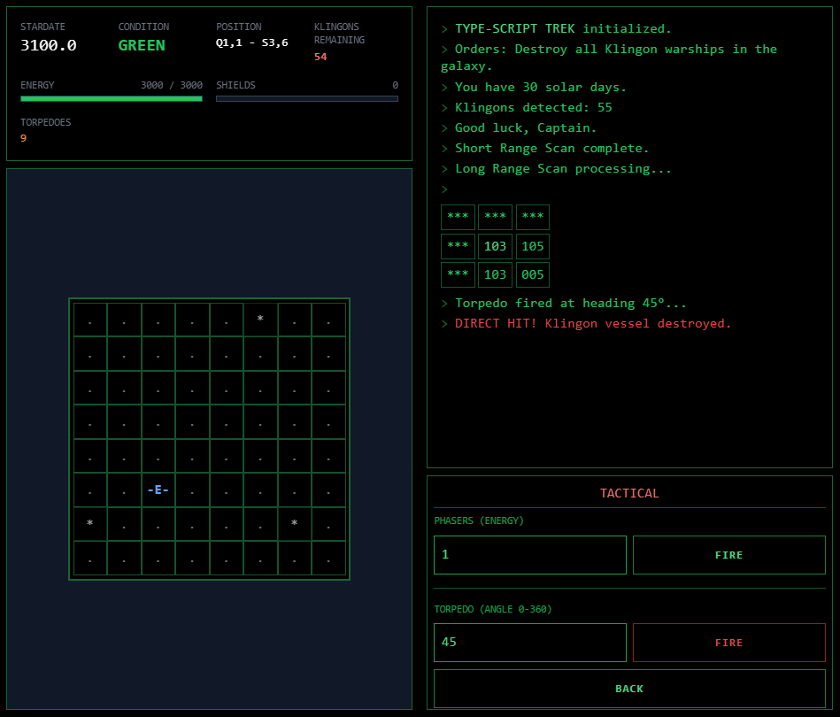

# TypeScript-Trek

[](LICENSE)

## Screenshots

**Main Window:**


## Description
**TypeScript-Trek** is a browser-based, retro-styled tactical space combat game inspired by the classic 1971 *Star Trek* text game. The player commands the USS Enterprise on a mission to purge the galaxy of Klingon warships within a strict time limit. 

The game combines resource management (Energy, Torpedoes, Time) with grid-based tactical combat. It features a responsive "terminal" interface, separating the visual sector scan from the command log. The universe is procedurally generated each run, ensuring a unique strategic challenge every time.

## Functionality

### Core Features
- **Procedural Galaxy**: An 8x8 grid of "Quadrants", where each Quadrant contains an 8x8 grid of "Sectors".
- **Turn-Based Combat**: Players act first; surviving enemies return fire immediately after specific actions (Movement, Firing weapons).
- **Resource Management**: 
  - **Energy**: Used for movement, shields, and phasers. Game over if depleted.
  - **Torpedoes**: Finite ammo for instant-kill attacks.
  - **Time**: Actions cost "Stardates". Game over if the deadline is exceeded.
- **Scanning Systems**:
  - **SRS (Short Range Scan)**: Visual representation of the immediate 8x8 sector.
  - **LRS (Long Range Scan)**: Numerical density scan of adjacent quadrants.
- **Docking**: Adjacent Starbases replenish energy, shields, and torpedoes to maximum.

### User Interface
The application uses a "split-screen" retro terminal layout using the `VT323` monospace font.

**Layout Structure:**
1.  **Left Panel (Status & Vis)**:
    -   **HUD**: Displays Stardate, Alert Level (Green/Red), Position (Q,S), Klingons Remaining.
    -   **Gauges**: Visual bars for Energy and Shields.
    -   **Main Viewscreen**: An 8x8 grid rendering the current sector using ASCII-style icons.
2.  **Right Panel (Comms & Control)**:
    -   **Terminal Log**: A scrolling history of actions, damage reports, and computer output.
    -   **Control Deck**: A context-sensitive button grid for issuing commands.

### Behavior Specifications

#### Movement (Warp)
- **Input**: The user selects a direction via a numeric keypad layout (1-9, where 8 is Up/North, 6 is Right/East).
- **Mechanics**: 
  - Movement consumes Energy and advances Stardate.
  - Moving off the edge of the 8x8 Sector grid transitions the ship to the adjacent Quadrant.
  - Hitting the edge of the Galaxy (Quadrant 0 or 7 boundaries) triggers a "Galactic Barrier" bounce (move cancelled).
  - Movement is blocked by Stars and Klingons within the same sector.

#### Combat: Phasers
- **Input**: Player specifies an amount of Energy to fire.
- **Mechanics**: 
  - Auto-targets *all* Klingons in the current sector.
  - Damage is calculated as `(Energy / Targets) / Distance`.
  - Damage has a randomized variance factor.
  - Energy is deducted immediately.

#### Combat: Photon Torpedoes
- **Input**: Player specifies a firing angle in degrees (0-360).
- **Mechanics**:
  - Requires and consumes 1 Torpedo.
  - Uses raycasting / step-simulation along the vector.
  - Hits the *first* entity in the path.
  - **Klingon**: Instantly destroyed.
  - **Star**: Torpedo absorbed (wasted).
  - **Starbase**: Destroyed. **Critical Condition**: Destroying a Starbase results in immediate Game Over (Loss).

#### Shields
- **Input**: Toggle command.
- **Mechanics**: Transfers available Energy to Shields up to a maximum limit (2000 units). Shields absorb incoming damage 1:1. Once shields fail, Hull (Energy) takes the damage.

#### Computer
- Calculates and displays the Distance and Bearing (Angle) to all entities in the current sector relative to the Enterprise.

#### Win/Loss States
- **Victory**: All Klingons in the galaxy are destroyed.
- **Defeat**: 
  - Enterprise Energy drops to 0 or below.
  - Stardate exceeds the Time Limit.
  - Player destroys a friendly Starbase.

## Technical Implementation

### Architecture
The application is a Single Page Application (SPA) built with **React**. It maintains a monolithic `GameState` object that is updated immutably based on user commands (`GameCommand`).

### Data Structures

#### Coordinates
- **Position**: `{ x: number, y: number }` (0-indexed integers).
- **Grid**: Y-axis increases downwards (0 is top), X-axis increases rightwards.

#### Galaxy Map
A 2D array (8x8) of `QuadrantData`:
```typescript
interface QuadrantData {
  klingons: number;
  starbases: number;
  stars: number;
  scanned: boolean; // Tracks if visited/LRS'd for map display
}
```

#### Sector Map
A list of `Entity` objects for the current sector only:
```typescript
enum EntityType { EMPTY, ENTERPRISE, KLINGON, STARBASE, STAR }

interface Entity {
  id: string;
  type: EntityType;
  x: number; // 0-7
  y: number; // 0-7
  hp?: number; // Only for Klingons
}
```

### Algorithms

#### Raycasting (Torpedoes)
The torpedo path is calculated using simple trigonometry steps:
1. Convert Angle (Degrees) to Radians.
2. `StepX = Math.cos(theta)`, `StepY = -Math.sin(theta)` (Note the negative Y due to grid coordinates).
3. Iterate ~12 steps (1.5x Sector Size).
4. Round coordinates to nearest integer to check for collisions.

#### Enemy AI
After the player performs an action that passes time (Warp, Phaser, Torpedo):
1. Identify all Klingons in the current sector.
2. Each Klingon deals random damage (`KLINGON_MIN_POWER` to `KLINGON_MAX_POWER`).
3. Total damage is applied to Player Shields first, then Energy.

### Constants
- **Grid Size**: 8x8 Quadrants, 8x8 Sectors.
- **Initial State**: 3000 Energy, 10 Torpedoes, Stardate 3100.
- **Time Limit**: 30 Stardates.
- **Costs**: 
  - Warp: 10 Energy per sector.
  - Time: 0.1 Stardates per move.
  - Shield Drain: 50 per hit.

## Style Guide
- **Visual Theme**: "Mainframe Terminal".
- **Colors**:
  - Background: Black (`#000000`).
  - Primary Text: Terminal Green (`#33ff33`).
  - Alert/Enemy: Red (`text-red-500`).
  - Starbase/Warning: Amber/Yellow (`text-yellow-400`).
- **Typography**: `VT323` from Google Fonts.
- **Responsiveness**: Layout stacks vertically on mobile, side-by-side on desktop.
- **Effects**: CSS `animate-pulse` for Red Alert status and Klingon entities.

<!-- ZS:COMPLEXITY:MEDIUM -->
<!-- ZS:PLATFORM:WEB -->
<!-- ZS:LANGUAGE:TYPESCRIPT -->

## Run Locally

**Prerequisites:**  Node.js

1. Install dependencies:
   `npm install`
2. Run the app:
   `npm run dev`

## License

This project is licensed under the MIT License - see the [LICENSE](LICENSE) file for details.

## Acknowledgments

*   Special thanks to ScuffedEpoch for the [TINS](https://github.com/ScuffedEpoch/TINS) methodology and the initial example.
*   Thanks to Eric Fredricksen and the original [Progress Quest Web](https://bitbucket.org/grumdrig/pq-web) project contributors for the original game – you are a legend.
*   **AI Assistance:**
    *   Thanks to the AI assistants used during development for their contributions.
    *   Tested with Gemini-3-pro-preview from Google AI Studio App development.
